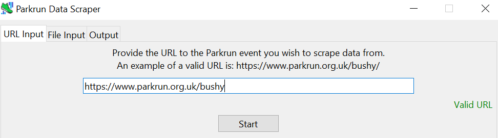

# Parkrun Data Scraper

Parkrun is a weekly free timed 5k running event mostly based in the UK and Ireland, but also has various events worldwide.

Previously, various statistics were readily available to see, providing insights on events such as course records and event popularity. Unfortunately, most of this has been **removed** on the website to apparently promote inclusivity of Parkrun. This has frustrated some advanced or curious runners wishing to investigate these factors before partaking in an event.

Nonetheless, most of the statistics are still deducible by processing the **summary table** of past events. This simple project takes the HTML of that page, parses it, and generates detailed statistics and graphs accordingly. Notably, the project takes the data a step further than what the website previously displayed with even more metrics.

Also, Parkrun has **anti-bot** measures in place which this program will circumvent to a reasonable degree. In order to minimise the burden, a semi-manual procedure can be followed which does not involve programmatic requests - virtually immune to anti-bot mechanisms. This is a fallback in case the automated scraping strategy fails.

Anyways, here is a list of features that this program provides:
- **Automated data collection** - simply provide the event URL and the program attempts to fetch the corresponding data.
- **Manual input** - download the HTML page containing the event data and input the HTML file into the program for equivalent parsing.
- **Statistics output** - output various metrics such as average finishers/volunteers, course records, top winners (most 1st place finishes) and general stats.
- **Graphs** - graphs for finishers/volunteers/male 1st time/female 1st time against event date, allowing for analysis of long-term trends.
- **Data exportation** - the data obtained by the program can be converted into tabular (CSV/XLSX) form or a report (DOCX/PDF).

## Requirements and Installation

The program is somewhat compartmentalised so unsatisfied requirements do not automatically mean complete unusability. Note the following:
- The automated scraping requires **Google Chrome** to be installed, which if not installed, this feature cannot be used and the semi-manual input method must be used instead.
- The program has been developed and tested on **Windows**, and should work for MacOS but this is not guaranteed.
- Saving data as a PDF requires **Microsoft Word** to be installed, otherwise cannot be performed (DOCX exportation still possible).
- **Internet connectivity** is obviously required.

The program can be run in two ways, either through a EXE file or through Python directly. Both methods will be covered.

### EXE

A Windows EXE has been built and is available in the Releases section of this project. Note, this only works for Windows, and unfortunately MacOS users must run the program through Python. Similarly, if there security issues, Python will be the only choice.

1. Download the EXE from the Releases section of this project.
2. Run the EXE. If successful, the GUI will launch, ready for use (see next section for guide).

### Python

The program has been written purely in Python due to the nature of the program being small-scale simple data scraping and processing.

Anyways, to run through Python, the following must be noted:

- Python **3.10** and above is supported.
- The following 3rd party libraries should be installed. They are listed in the `requirements.txt` file. Use pip as usual to install the libraries if needed.
    - `selenium` - used for automatically scraping the data from the website using a Chrome driver. Raw requests do not work because of the anti-bot mechanisms, but a headless web driver works when some spoofing is used.
    - `beautifulsoup4` - used for parsing the HTML data representing the historical data page.
    - `lxml` (optional) - for fast, robust HTML parsing.
    - `matplotlib` - used for plotting graphs.
    - `openpyxl` - allows for data exportation to XLSX (Excel) files.
    - `python-docx` - allows a DOCX report to be generated.
    - `comtypes` (optional) - used for PDF exportation on Windows.
    - `docx2pdf` (optional) - used for PDF exportation on MacOS, or if `comtypes` is not installed on Windows. Either `comptypes` (Windows only) or `docx2pdf` must be installed for PDF generation.

Provided the above is satisfied, follow these steps to run through Python:
1. Download the project folder, ensuring all files are available.
2. Run the `src/main.py` file and if successful, the GUI will launch, ready for use (see guide).

More technical users may adapt the code to meet their unique situations, which is permitted.

## Usage Guide

Now that the program has been set up, below is the functionality of each section explained. Note, tiny details may be omitted, so feel free to explore the program to find out how it works in greater depth.

### URL Input

This is the automated scraping section where you can simply input the event URL and data will be fetched automatically and subsequently parsed. As already mentioned, Chrome must be installed on the computer for this input method to work. If this is not the case, refer to File Input for the alternative method.

The screen should look like this:

1. Enter the **URL** of the Parkrun event to analyse. Validation is included to ensure robustness, but there is some leniency in the input. The following inputs are accepted:
    - Full URL to event page e.g. https://www.parkrun.org.uk/bushy
    - Partial URL to event page e.g. parkrun.org.uk/bushy
    - Full URL to event history page e.g. https://www.parkrun.org.uk/bushy/results/eventhistory/
    - Partial URL to event page e.g. parkrun.org.uk/bushy/results/eventhistory/
Here is an example of a correctly filled in URL:

2. Click 'Start', and the data collection will occur followed by stats output if successful. Be patient - this may take 10-20 seconds depending on Parkrun server load.

### File Input

In case automated data collection fails due to anti-bot mechanisms, missing Chrome or any other reason, a second undetectable way of getting the data into the program is by **loading the web page manually**, downloading it, and inputting the downloaded HTML file into the program, which can be handled in the same way as if the HTML were programmatically obtained.

1. **Manually navigate** to the **event history** page for the target event e.g. https://www.parkrun.org.uk/bushy/results/eventhistory/. 
2. **Right click** on this page and press on **'Save As'** as seen below:

3. The file dialog should appear. Ensure the file save mode is set to **'Web Page, Complete'**, and then press 'Save'.

4. Wait until the file has finished downloading, which should take no more than **10-20 seconds**.
5. You will notice a complementary **folder** is downloaded alongside the main HTML file. Simply **ignore or delete** this folder. The focus is the HTML file. Click **'Select File'** in the program and select this **HTML file**. Provided the file is unmodified and the instructions have been followed, this should result in the data being parsed and displayed.

### Output

Upon successful data parsing using either input method, the output screen will be populated with various data points relating to the event. An example output is shown below:

#### Data Points

The data points seen in the output screen mean the following:

##### Event Popularity

These metrics mainly focus on the **popularity** of the event - whether there are usually few participants or a lot. Some people may prefer quiet events; others may prefer larger events.
- **Mean finishers** - the average number of finishers per event (all time finishes divided by number of events).
- **Median finishers** - alternative average number of finishers taken as the middle value of the data set.
- **Mean volunteers** - the average number of volunteers per event (all time volunteer instances divided by number of events).
- **Median volunteers** - alternative average number of volunteers (middle value).

##### Competitive

These stats provide insights on the level of **competitiveness** of the event, designed for the most serious runners.
- **Male course record** - fastest male time for the course, including athlete name, athlete ID and the time.
- **Female course record** - same as male course record but for females.
- **Mean male 1st time** - the average time obtained by the 1st male, good for gauging the general difficulty of achieving 1st male.
- **Mean female 1st time** - same as above but for females.
- **Most frequent male winners** - the male participants with the most 1st place finishes.
- **Most frequent female winners** - same as above but for females.

##### General

Most of these metrics can also still be seen on the website so are less interesting but the program captures them anyway for convenience.
- **Event count** - the number of events that have taken place on the course.
- **Cancellation rate** - the number of weeks without an event divided by the total weeks between the most recent and first event. This only considers **Saturday** events (not special holiday events). Also, **COVID** caused Parkrun to pause events for an extended time, so this metric will be significantly skewed to be excessively high for most events. Take with a pinch of salt.
- **Finishes** - the number of times participants completed the event.
- **Finishers** - the number of unique participants that have completed the event at least once.
- **Volunteers** - the number of unique volunteers that have completed a volunteer role at least once.
- **Personal bests** - the number of instances where a participant obtained a new PB for the course.
- **Mean finish time** - the average time taken to finish the course. Good for gauging the difficulty of a course and/or the general level of performance of participants.
- **Groups** - the number of groups that have had at least one member complete the event at least once. A group could be a club or equivalent.
- **Email** - the email address of the event, where inquiries regarding the event can be sent.

#### Graphs

Whilst the data points are useful, the averages can be misleading because an event's popularity and competitiveness can **change over time**. For a deeper understanding of these metrics, graphs are provided to illustrate trends in the following metrics:

- Finisher count
- Volunteer count
- 1st Male Time
- 1st Female Time

Hence, click the corresponding buttons in the output screen to open the graph of the selected metric against date. For example, the following displays finishers against date:

Note the strange long line in around 2021 - this is due to COVID where events were paused for around a year. Hence, there is a large time gap between the last event before COVID and the first event after COVID leading to this strange line. This is unfortunately the case for most graphs, simply ignore and focus on the general trend. Conversely, this provides some insight into how COVID has affected these metrics, for example, are there more or less participants post-COVID than pre-COVID?

#### Data Exportation

The data looks good in the GUI, but is rather limited nonetheless (stuck in the program). Hence, the program allows exportation of this data in either **tabular or report** form. This allows for external data analysis and data sharing.

- **CSV/XLSX** - the program generates a table containing the following metrics for each event and saves as a CSV or XLSX:
    - Event Number
    - Date
    - Finishers
    - Volunteers
    - Male 1st Name
    - Male 1st Athlete ID
    - Male 1st Seconds
    - Female 1st Name
    - Female 1st Athlete ID
    - Female 1st Seconds
- **DOCX/PDF** - the program generates a report consisting of all the data and graphs, in a simple, readable document. The structure of the report is summarised as follows:
    - Event popularity metrics and graphs
    - Competitive metrics and graphs
    - Summary metrics

Simply click the relevant save button to select the desired output format and set the save file path. Hopefully in a few seconds, the output file will have been successfully created. CSV should be fastest, followed by XLSX, then DOCX, and PDF is likely to be slowest.

## Limitations

The program is simple yet effective, with clean code, but nonetheless has limitations - some of which could be fixed with further development, others not so much. Nonetheless, these issues are non-critical such that the program is still generally functional and achieves what it should:
- Only Parkrun events whose website is in **English** are currently supported. This includes events in the UK, Ireland, USA etc. The program fails for events in Japan, Germany and The Netherlands, for example.
- **Rare edge cases** mean the program is not guaranteed to work properly for certain events with limited or strange data - especially very new events. In general though the program has demonstrated to work correctly, including robustness towards basic edge cases.
- As the program involves web scraping, **website changes** could break the program at any time. Also, new anti-bot features may render the automative scraping dysfunctional, so this also may stop working abruptly.
- Overuse of the program may cause **IP blocks** and equivalent bans from Parkrun. RESPONSIBLE USE OF THE PROGRAM MINIMISES THIS RISK AND REDUCES PARKRUN SERVER BURDEN. For minimal risk, consider only using the manual technique (takes more effort, but will not be detected as automated web traffic).
- The PDF generation relies on generating a DOCX first before converting to a PDF. The DOCX to PDF process relies on an instance of Microsoft Word and is **very unstable**. Whilst conversion usually completes in 5-10 seconds, the program may **freeze** for an extended time (such as 1-2 minutes). Only use this feature if you can handle a bit of possible instability, especially on MacOS, where this has not been tested. Remember that Microsoft Word must also be installed for PDF generation. 

## Disclaimer

The program is free to use and the source code can be modified as you wish. However, there is ZERO LIABILITY for damages caused by usage of the program.

IMPORTANTLY, PLEASE USE THE PROGRAM REASONABLY SUCH THAT THERE IS NO SIGNIFICANT BURDEN ON PARKRUN SERVERS. REMEMBER, THE MORE INTENSIVELY YOU USE THIS PROGRAM, THE HIGHER THE RISK OF DETECTION AND SUBSEQUENT BLOCKS.

For licensing information, see the [license](LICENSE).